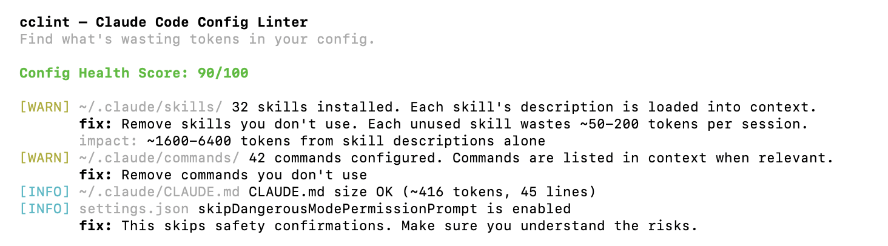

# cclint

[](https://github.com/SingggggYee/cclint/stargazers)
[](LICENSE)
[](https://www.rust-lang.org/)

> claude-usage-analyzer tells you where tokens went. cclint tells you what to fix in your config.

Lint your Claude Code setup. Finds token waste in your CLAUDE.md, hooks, skills, and commands. Gives you a health score and actionable fixes.

## Example Output



<details>
<summary>Text version</summary>

```
  cclint — Claude Code Config Linter
  Find what's wasting tokens in your config.

  Config Health Score: 90/100

  [WARN] ~/.claude/skills/ 32 skills installed. Each skill's description is loaded into context.
         fix: Remove skills you don't use. Each unused skill wastes ~50-200 tokens per session.
         impact: ~1600-6400 tokens from skill descriptions alone
  [WARN] ~/.claude/commands/ 42 commands configured. Commands are listed in context when relevant.
         fix: Remove commands you don't use
  [INFO] ~/.claude/CLAUDE.md CLAUDE.md size OK (~416 tokens, 45 lines)
  [INFO] settings.json skipDangerousModePermissionPrompt is enabled
         fix: This skips safety confirmations. Make sure you understand the risks.
```
</details>

## Install

```bash
cargo install cclint
```

Or build from source:

```bash
git clone https://github.com/SingggggYee/cclint
cd cclint
cargo build --release
./target/release/cclint
```

## What It Checks

### CLAUDE.md
- File size and estimated token cost per API call
- Redundant verbosity rules (already Claude's default behavior)
- Contradictory rules
- Duplicate section headers
- Vague rules that waste tokens ("write clean code", "follow best practices")
- Very long lines (likely copy-pasted content)
- Missing structure (no headers)

### settings.json
- Total hook count and latency impact
- PreToolUse hooks without matcher (runs on every tool call)
- Dangerous permission settings

### Skills
- Total skill count and token impact from descriptions
- Skill directories without SKILL.md
- Follows symlinks (handles linked skill installations)

### Commands
- Total command count
- Oversized command files

## Usage

```bash
# Lint current directory + global config
cclint

# Lint specific project
cclint /path/to/project

# Skip global config
cclint --global false

# JSON output
cclint --json
```

## Health Score

100 = no issues. Each error costs 15 points, each warning costs 5 points.

| Score | Meaning |
|-------|---------|
| 80-100 | Good. Minor optimizations possible. |
| 50-79 | Needs attention. Likely wasting tokens. |
| 0-49 | Fix immediately. Significant token waste. |

## Works with ccwhy

Use together for full usage optimization:
- [ccwhy](https://github.com/SingggggYee/ccwhy) — tells you where tokens went (past usage)
- **cclint** — tells you what to fix in your config (prevent future waste)

## FAQ

### How do I optimize my CLAUDE.md file?

Run `cclint` in your project directory. It analyzes your CLAUDE.md for vague rules, redundant instructions, and oversized content, then gives specific fixes to reduce token waste.

### What does cclint check?

cclint checks four areas: CLAUDE.md (size, vague rules, contradictions), settings.json (hooks, permissions), skills (count, missing SKILL.md), and commands (count, oversized files). Each issue gets a severity level with a concrete fix.

### Does cclint work with other AI coding agents?

cclint is designed specifically for Claude Code configurations. It checks CLAUDE.md, Claude Code hooks, skills, and commands. Other AI coding agents use different config formats and are not supported.

### How do I install cclint?

Install via `cargo install cclint` if you have Rust installed. Alternatively, clone the repo and build from source with `cargo build --release`.

### What's a good health score for CLAUDE.md?

A score of 80-100 means your config is in good shape with only minor optimizations possible. Below 50 means significant token waste — you should fix the reported issues immediately.

## License

MIT
